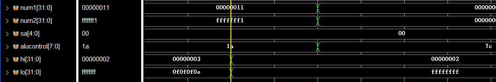
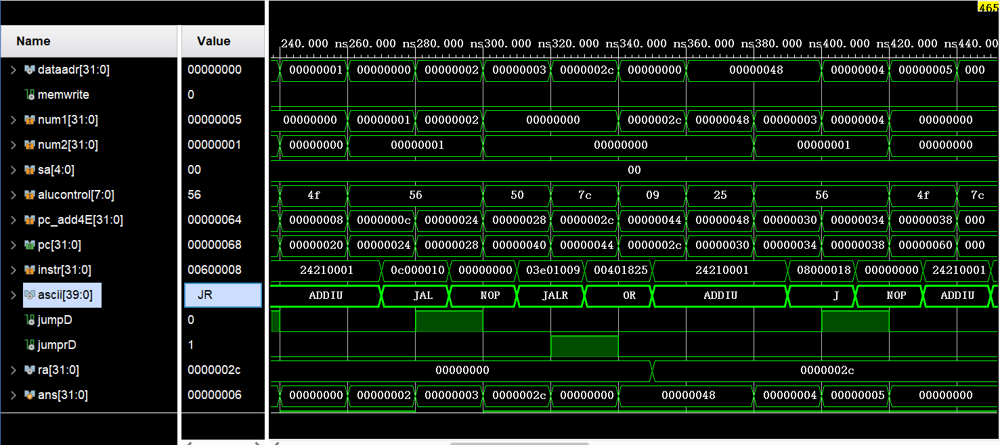

# MIPS_HARDWARE
MipsVerilog

## **信号控制码译码信号**

| 指令说明 | instruction | op[5:0]/funct[5:0] | regwrite | regdst | alusrc | branch | memWrite | memtoReg | jump |
| -------- | :---------: | :----------------: | :------: | :----: | :----: | :----: | :------: | :------: | ---- |
|          |   R-type    |       000000       |    1     |   1    |   0    |   0    |    0     |    0     | 0    |
|          |     lw      |       100011       |    1     |   0    |   1    |   0    |    0     |    1     | 0    |
|          |     sw      |       101011       |    0     |   x    |   1    |   0    |    1     |    x     | 0    |
|          |     beq     |       000100       |    0     |   x    |   0    |   1    |    0     |    x     | 0    |
|          |    addi     |       001000       |    1     |   0    |   1    |   0    |    0     |    0     | 0    |
|          |      j      |       000010       |    0     |   x    |   x    |   x    |    0     |    x     | 1    |
|          |             |                    | regwrite | regdst | alusrc | branch | memWrite | memtoReg | jump |
| logic    |     and     |       100100       |    1     |   1    |   0    |   0    |    0     |    0     | 0    |
|          |     or      |       100101       |    1     |   1    |   0    |   0    |    0     |    0     | 0    |
|          |     xor     |       100110       |    1     |   1    |   0    |   0    |    0     |    0     | 0    |
|          |     nor     |       100111       |    1     |   1    |   0    |   0    |    0     |    0     | 0    |
|          |    andi     |       001100       |    1     |   0    |   1    |   0    |    0     |    0     | 0    |
|          |    xori     |       001110       |    1     |   0    |   1    |   0    |    0     |    0     | 0    |
|          |     lui     |       001111       |    1     |   0    |   1    |   0    |    0     |    0     | 0    |
|          |     ori     |       001101       |    1     |   0    |   1    |   0    |    0     |    0     | 0    |
|          |             |                    | regwrite | regdst | alusrc | branch | memWrite | memtoReg | jump |
| shift    |     sll     |       000000       |    1     |   1    |   0    |   0    |    0     |    0     | 0    |
|          |     srl     |       000010       |    1     |   1    |   0    |   0    |    0     |    0     | 0    |
|          |     sra     |       000011       |    1     |   1    |   0    |   0    |    0     |    0     | 0    |
|          |    sllv     |       000100       |    1     |   1    |   0    |   0    |    0     |    0     | 0    |
|          |    srlv     |       000110       |    1     |   1    |   0    |   0    |    0     |    0     | 0    |
|          |    srav     |       000111       |    1     |   1    |   0    |   0    |    0     |    0     | 0    |
|          |             |                    | regwrite | regdst | alusrc | branch | memWrite | memtoReg | jump |
| move     |    mfhi     |       010000       |    1     |   1    |   0    |   0    |    0     |    0     | 0    |
|          |    mflo     |       010010       |    1     |   1    |   0    |   0    |    0     |    0     | 0    |
|          |    mthi     |       010001       |    0     |   0    |   0    |   0    |    0     |    0     | 0    |
|          |    mtlo     |       010011       |    0     |   0    |   0    |   0    |    0     |    0     | 0    |
|          |             |                    | regwrite | regdst | alusrc | branch | memWrite | memtoReg | jump |
| 算术     |     add     |       100000       |    1     |   1    |   0    |   0    |    0     |    0     | 0    |
|          |    addu     |       100001       |    1     |   1    |   0    |   0    |    0     |    0     | 0    |
|          |     sub     |       100010       |    1     |   1    |   0    |   0    |    0     |    0     | 0    |
|          |    subu     |       100011       |    1     |   1    |   0    |   0    |    0     |    0     | 0    |
|          |     slt     |       101010       |    1     |   1    |   0    |   0    |    0     |    0     | 0    |
|          |    sltu     |       101011       |    1     |   1    |   0    |   0    |    0     |    0     | 0    |
|          |    mult     |       011000       |    1     |   1    |   0    |   0    |    0     |    0     | 0    |
|          |    multu    |       011001       |    1     |   1    |   0    |   0    |    0     |    0     | 0    |
|          |     div     |       011010       |    1     |   1    |   0    |   0    |    0     |    0     | 0    |
|          |    divu     |       011011       |    1     |   1    |   0    |   0    |    0     |    0     | 0    |
|          |    addi     |       001000       |    1     |   0    |   1    |   0    |    0     |    0     | 0    |
|          |    addiu    |       001001       |    1     |   0    |   1    |   0    |    0     |    0     | 0    |
|          |    slti     |       001010       |    1     |   0    |   1    |   0    |    0     |    0     | 0    |
|          |    sltiu    |       001011       |    1     |   0    |   1    |   0    |    0     |    0     | 0    |
|          |             |                    | regwrite | regdst | alusrc | branch | memWrite | memtoReg | jump |
| 访存     |     lb      |       100000       |    1     |   0    |   1    |   0    |    0     |    1     | 0    |
|          |     lbu     |       100100       |    1     |   0    |   1    |   0    |    0     |    1     | 0    |
|          |     lh      |       100001       |    1     |   0    |   1    |   0    |    0     |    1     | 0    |
|          |     lhu     |       100101       |    1     |   0    |   1    |   0    |    0     |    1     | 0    |
|          |     lw      |       100011       |    1     |   0    |   1    |   0    |    0     |    1     | 0    |
|          |     sb      |       101000       |    0     |   0    |   1    |   0    |    1     |    0     | 0    |
|          |     sh      |       101001       |    0     |   0    |   1    |   0    |    1     |    0     | 0    |
|          |     sw      |       101011       |    0     |   0    |   1    |   0    |    1     |    0     | 0    |
|          |             |                    |          |        |        |        |          |          |      |
|          |             |                    |          |        |        |        |          |          |      |
|          |             |                    |          |        |        |        |          |          |      |
|          |             |                    |          |        |        |        |          |          |      |
|          |             |                    |          |        |        |        |          |          |      |


## 工作日志

#### 2020.12.25

|    时间     |  人员  |                           工作内容                           |
| :---------: | :----: | :----------------------------------------------------------: |
| 10:00-12:00 | 屈湘钧 | 复习计组4的简单五级流水线cpu，并大致整理任务目标和初步的上手想法。 |
| 15:00-18:00 | 屈湘钧 | 学习吕学长教学视频1、2关于57条指令添加教程，并大致思考了添加指令的第一步译码做法，计划明天开始正式开始写controller中的译码和alu译码，分类添加指令集。 |
| 8:00-18:00  | 朱海龙 |             分析实验通路，阅读soc，axi，sram资料             |

#### 2020.12.26

|    时间     |  人员  |                           工作内容                           |
| :---------: | :----: | :----------------------------------------------------------: |
| 10:10-12:00 | 屈湘钧 |                    基本写完alu_dec.v文件                     |
| 14:20-18:00 | 屈湘钧 | 完成大部分逻辑运算指令添加工作；变更指令编码后的计组4测试调试通过 |
| 8:50-17:30  | 朱海龙 |       阅读测试文档，初步完成main_dec和controller的编写       |

#### 2020.12.27

|    时间     |  人员  |                  工作内容                   |
| :---------: | :----: | :-----------------------------------------: |
| 14:40-18:00 | 屈湘钧 |     完成逻辑运算指令8条的添加和测试工作     |
| 9:00-18:30  | 朱海龙 | 完成移位指令添加，完成部分hilo_move指令添加 |

#### 2020.12.28

|    时间     |  人员  |                        工作内容                         |
| :---------: | :----: | :-----------------------------------------------------: |
| 14:30-24:00 | 屈湘钧 |    听课，做算术指令的添加，已完成初步代码，正在测试     |
| 8:30-12:00  | 朱海龙 | 完成数据移动指令，修复移位指令bug，完成这两类指令的测试 |

#### 2020.12.29

|    时间     |  人员  |                          工作内容                          |
| :---------: | :----: | :--------------------------------------------------------: |
| 13:00-17:45 | 屈湘钧 | 完成算术指令14条的添加与测试通过，初步想好了访存指令的构建 |
| 8:30-12:00  | 朱海龙 |   完成分支branch指令(包含分支预测)，并完成分支branch测试   |

#### 2020.12.30

|    时间     |  人员  |                        工作内容                         |
| :---------: | :----: | :-----------------------------------------------------: |
| 10:30-12:30 | 屈湘钧 |                       做访存指令                        |
| 14:30-19:30 | 屈湘钧 |   基本完成访存指令代码，测试通过计组4，还未做单元测试   |
| 8:30-12:00  | 朱海龙 | 完成跳转jump指令(包含jal的数据前推)，并完成跳转jump测试 |

#### 2021.01.01

|    时间     |  人员  |                          工作内容                          |
| :---------: | :----: | :--------------------------------------------------------: |
| 12:00-24:00 | 朱海龙 | 修改分支预测机制，将延迟槽指令先运行，并重新测试branch指令 |
| 12:00-24:00 | 屈湘钧 | 完成访存指令的所有单元测试，分析解决访存冒险，并开始看中断 |

#### 2021.01.02

|    时间     |  人员  |                  工作内容                  |
| :---------: | :----: | :----------------------------------------: |
| 12:00-24:00 | 朱海龙 | 尝试连接sram接口，出现无法读取trace文件bug |
| 13:30-23:00 | 屈湘钧 |    添加异常相关的代码，重复测试以往coe     |

#### 2021.01.03

|    时间     |  人员  |                    工作内容                     |
| :---------: | :----: | :---------------------------------------------: |
| 10:00-24:00 | 朱海龙 | sram接口连接，修复部分指令bug，完成52条指令测试 |
| 13:30-23:00 | 屈湘钧 |    内陷&特权5条指令单元测试完成,开始功能测试    |

#### 2021.01.04

|    时间     |  人员  |                           工作内容                           |
| :---------: | :----: | :----------------------------------------------------------: |
| 10:00-24:00 | 朱海龙 | 协助队友调错，尝试封装axi接口和修改体系结构实验的cache(未成功) |
| 13:30-24:00 | 屈湘钧 |        完成功能测试3的内陷&特权，完成全部功能测试89条        |

#### 2021.01.05

|    时间     |  人员  |                  工作内容                  |
| :---------: | :----: | :----------------------------------------: |
| 9:00-24:00  | 朱海龙 | axi接口连接，修复部分bug，完成52条功能测试 |
| 13:30-24:00 | 屈湘钧 |        学习axi，sram soc上板子成功         |


## 测试日志

|    时间    |  人员  |                  测试                  |
| :--------: | :----: | :------------------------------------: |
| 2020.12.27 | 屈湘钧 |      logic8条指令部分单元测试完成      |
| 2020.12.28 | 朱海龙 |      shift6条指令部分单元测试完成      |
| 2020.12.28 | 朱海龙 |     move_hilo四条指令单元测试完成      |
| 2020.12.29 | 屈湘钧 |        运算指令14条单元测试完毕        |
| 2020.12.29 | 朱海龙 |         分支指令branch单元测试         |
| 2020.12.30 | 朱海龙 |          跳转指令jump单元测试          |
| 2021.01.01 | 屈湘钧 |        访存指令8条完成单元测试         |
| 2021.01.02 | 屈湘钧 |        访存指令冒险单元测试完成        |
| 2021.01.03 | 屈湘钧 |      内陷&特权5条指令单元测试完成      |
| 2021.01.03 | 朱海龙 |    功能测试52条完成(trace1,trace2)     |
| 2021.01.04 | 屈湘钧 |    功能测试特权内陷指令通过(trace3)    |
| 2021.01.04 | 屈湘钧 |       功能测试89个测试点全部通过       |
| 2021.01.05 | 朱海龙 | axi接口功能测试52条完成(trace1,trace2) |
| 2021.01.05 | 屈湘钧 |    sram版本57条指令功能测试上板成功    |


## 添加指令过程截图

#### 逻辑指令测试完成

```assembly
   lui  $1,0x0101
   ori  $1,$1,0x0101
   ori  $2,$1,0x1100        # $2 = $1 | 0x1100 = 0x01011101
   or   $1,$1,$2            # $1 = $1 | $2 = 0x01011101
   andi $3,$1,0x00fe        # $3 = $1 & 0x00fe = 0x00000000
   and  $1,$3,$1            # $1 = $3 & $1 = 0x00000000
   xori $4,$1,0xff00        # $4 = $1 ^ 0xff00 = 0x0000ff00
   xor  $1,$4,$1            # $1 = $4 ^ $1 = 0x0000ff00
   nor  $1,$4,$1            # $1 = $4 ~^ $1 = 0xffff00ff   nor is "not or"
```


#### 移位指令测试完成

```asm
   lui   $2,0x0404
   ori   $2,$2,0x0404
   ori   $7,$0,0x7
   ori   $5,$0,0x5
   ori   $8,$0,0x8
   sll   $2,$2,8    ## $2 = 0x40404040 sll 8  = 0x04040400
   sllv  $2,$2,$7   ## $2 = 0x04040400 sll 7  = 0x02020000
   srl   $2,$2,8    ## $2 = 0x02020000 srl 8  = 0x00020200
   srlv  $2,$2,$5   ## $2 = 0x00020200 srl 5  = 0x00001010
   nop
   sll   $2,$2,19   ## $2 = 0x00001010 sll 19 = 0x80800000
   sra   $2,$2,16   ## $2 = 0x80800000 sra 16 = 0xffff8080
   srav  $2,$2,$8   ## $2 = 0xffff8080 sra 8  = 0xffffff80 
```


#### 数据移动指令测试完毕

```assembly
   lui $1,0x0000          # $1 = 0x00000000
   lui $2,0xffff          # $2 = 0xffff0000
   lui $3,0x0505          # $3 = 0x05050000
   lui $4,0x0000          # $4 = 0x00000000 

   mthi $0                ## hi = 0x00000000
   mthi $2                ## hi = 0xffff0000
   mthi $3                ## hi = 0x05050000
   mfhi $4                ## $4 = 0x05050000

   mtlo $3                ## lo = 0x05050000
   mtlo $2                ## lo = 0xffff0000
   mtlo $1                ## lo = 0x00000000
   mflo $4                ## $4 = 0x00000000        
## 下图中出现的红色信号的原因是前几条指令一直在操作hi，所以lo就一直是未定义状态
```


#### 简单算术指令测试（包含乘法，不包含除法）

```assembly
   ######### add\addi\addiu\addu\sub\subu ##########

   ori  $1,$0,0x8000           # $1 = 0x8000
   sll  $1,$1,16               # $1 = 0x80000000
   ori  $1,$1,0x0010           # $1 = 0x80000010

   ori  $2,$0,0x8000           # $2 = 0x8000
   sll  $2,$2,16               # $2 = 0x80000000
   ori  $2,$2,0x0001           # $2 = 0x80000001

   ori  $3,$0,0x0000           # $3 = 0x00000000
   addu $3,$2,$1               # $3 = 0x00000011
   ori  $3,$0,0x0000           # $3 = 0x00000000
   add  $3,$2,$1               # overflow,$3 keep 0x00000000

   sub   $3,$1,$3              # $3 = 0x80000010         
   subu  $3,$3,$2              # $3 = 0xF

   addi $3,$3,2                # $3 = 0x11
   ori  $3,$0,0x0000           # $3 = 0x00000000
   addiu $3,$3,0x8000          # $3 = 0xffff8000

   #########     slt\sltu\slti\sltiu     ##########

   ori   $1,$0,0xffff           # $1 = 0xffff
   sll  $1,$1,16               # $1 = 0xffff0000
   slt  $2,$1,$0               # $2 = 1
   sltu $2,$1,$0               # $2 = 0
   slti $2,$1,0x8000           # $2 = 1
   sltiu $2,$1,0x8000          # $2 = 1

   #########          mult/multu          ##########

   ori  $1,$0,0xffff           # $1 = 0xffff
   sll  $1,$1,16               # $1 = 0xffff0000
   ori  $1,$1,0xfffb           # $1 = -5
   ori  $2,$0,6                # $2 = 6  
   mult $1,$2                  # hi = 0xffffffff
                               # lo = 0xffffffe2

   multu $1,$2                 # hi = 0x5
                               # lo = 0xffffffe2
   nop
   nop
```


#### 除法运算指令测试

```assembly
   ori  $2,$0,0xffff                  
   sll  $2,$2,16
   ori  $2,$2,0xfff1           # $2 = -15
   ori  $3,$0,0x11             # $3 = 17

   div $zero,$2,$3             # hi = 0xfffffff1            
                               # lo = 0x0
   divu $zero,$2,$3            # hi = 0x00000003
                               # lo = 0x0f0f0f0e

   div  $zero,$3,$2            # hi = 2
                               # lo = 0xffffffff
```

图1为DIV和DIVU的结果，图2位DIVU和DIV的结果。

图3为DIV与DIVU指令间，需要stall流水线的信号和结果ok的信号。





#### 分支branch指令测试

```assembly
   .org 0x0
   .set noat
   .set noreorder
   .set nomacro
   .global _start
_start:
   ori  $3,$0,0x8000
   sll  $3,16               # $3 = 0x80000000
   ori  $1,$0,0x0001        # $1 = 0x1                
   b    s1
   ori  $1,$0,0x0002        # $1 = 0x2
1:
   ori  $1,$0,0x1111
   ori  $1,$0,0x1100

   .org 0x20
s1:
   ori  $1,$0,0x0003        # $1 = 0x3          
   bal  s2
   div  $zero,$31,$1        # $31 = 0x2c, $1 =0x3
                            # HI = 0x2, LO = 0xe 
   ori  $1,$0,0x1100
   ori  $1,$0,0x1111
   bne  $1,$0,s3
   nop
   ori  $1,$0,0x1100
   ori  $1,$0,0x1111

   .org 0x50   
s2:
   ori  $1,$0,0x0004      # $1 = 0x4
   beq  $3,$3,s3           
   or   $1,$31,$0         # $1 = 0x2c
   ori  $1,$0,0x1111
   ori  $1,$0,0x1100
2:
   ori  $1,$0,0x0007      # $1 = 0x7
   ori  $1,$0,0x0008      # $1 = 0x8
   bgtz $1,s4
   ori  $1,$0,0x0009      # $1 = 0x9
   ori  $1,$0,0x1111
   ori  $1,$0,0x1100

   .org 0x80
s3:
   ori  $1,$0,0x0005      # $1 = 0x5            
   BGEZ $1,2b           
   ori  $1,$0,0x0006      # $1 = 0x6
   ori  $1,$0,0x1111
   ori  $1,$0,0x1100

   .org 0x100
s4:
   ori  $1,$0,0x000a      # $1 = 0xa              
   BGEZAL $3,s3
   or   $1,$0,$31         # $1 = 0x10c          
   ori  $1,$0,0x000b      # $1 = 0xb
   ori  $1,$0,0x000c      # $1 = 0xc
   ori  $1,$0,0x000d      # $1 = 0xd
   ori  $1,$0,0x000e      # $1 = 0xe
   bltz $3,s5
   ori  $1,$0,0x000f      # $1 = 0xf
   ori  $1,$0,0x1100


   .org 0x130
s5:
   ori  $1,$0,0x0010      # $1 = 0x10            
   blez $1,2b           
   ori  $1,$0,0x0011      # $1 = 0x11
   ori  $1,$0,0x0012      # $1 = 0x12
   ori  $1,$0,0x0013      # $1 = 0x13
   bltzal $3,s6
   or   $1,$0,$31         # $1 = 0x14c
   ori  $1,$0,0x1100


   .org 0x160
s6:
   ori $1,$0,0x0014       # $1 = 0x14
   nop
   
_loop:
   j _loop
   nop

## 下图中包含了分支预测功能，因此可能部分过程与普通流水线不同，但大致路径相同
## predictD信号是预测是否跳转的信号
## 第二张图是修改了分支预测延迟槽先运行之后的测试截图
```


#### 跳转jump指令测试

```assembly
   .org 0x0
   .set noat
   .set noreorder
   .set nomacro
   .global _start
_start:
   addiu  $1,$0,0x0001   ## $1 = 0x1                
   j    0x20
   addiu  $1,$1,0x0001   ## $1 = 0x2
   addiu  $1,$1,0x1111
   addiu  $1,$1,0x1100

   .org 0x20
   addiu  $1,$1,0x0001   ## $1 = 0x3               
   jal  0x40
   nop
   addiu  $1,$1,0x0001   ## r1 = 0x4
   addiu  $1,$1,0x0001   ## r1 = 0x5
   j    0x60
   nop

   .org 0x40
               
   jalr $2,$31           
   or   $3,$2,$0          ## $3 = 0xb0000048
   addiu  $1,$1,0x0001    ## $1 = 0x8
   addiu  $1,$1,0x0001    ## $1 = 0x9
   addiu  $1,$1,0x0001    ## $1 = 0xa
   j 0x80
   nop

   .org 0x60
   addiu  $1,$1,0x0001    ## $1 = 0x6              
   jr   $3          
   addiu  $1,$1,0x0001    ## $1 = 0x7
   addiu  $1,$1,0x1111
   addiu  $1,$1,0x1100

   .org 0x80
   nop
    
_loop:
   j _loop
   nop

## 注意jal 以及 jalr类型的指令需要进行数据前推
## 注意j型指令延迟槽的设计
## ra是第31号寄存器，这里为了测试把它放出来，正常情况不能允许访问，由于数据前推机制，更新会在WB，但是可以正常读正确ra出来
```



#### 访存指令测试

```assembly
_start:
   ori  $3,$0,0xeeff
   sb   $3,0x3($0)       # [0x3] = 0xff
   srl  $3,$3,8
   sb   $3,0x2($0)       # [0x2] = 0xee
   ori  $3,$0,0xccdd
   sb   $3,0x1($0)       # [0x1] = 0xdd
   srl  $3,$3,8
   sb   $3,0x0($0)       # [0x0] = 0xcc
   lb   $1,0x3($0)       # $1 = 0xffffffff
   lbu  $1,0x2($0)       # $1 = 0x000000ee
   nop

   ori  $3,$0,0xaabb
   sh   $3,0x4($0)       # [0x4] = 0xaa, [0x5] = 0xbb
   lhu  $1,0x4($0)       # $1 = 0x0000aabb
   lh   $1,0x4($0)       # $1 = 0xffffaabb
 
   ori  $3,$0,0x8899
   sh   $3,0x6($0)       # [0x6] = 0x88, [0x7] = 0x99
   lh   $1,0x6($0)       # $1 = 0xffff8899
   lhu  $1,0x6($0)       # $1 = 0x00008899

   ori  $3,$0,0x4455
   sll  $3,$3,0x10
   ori  $3,$3,0x6677     
   sw   $3,0x8($0)       # [0x8] = 0x44, [0x9]= 0x55, [0xa]= 0x66, [0xb] = 0x77
   lw   $1,0x8($0)       # $1 = 0x44556677

   nop
    
_loop:
   j _loop
   nop
```

图1位sb、sh、lb、lbu、lh、lhu的测试；图2位sw、lw的测试


#### 有数据冒险lw+beq测试

```assembly
_start:
   ori $1,$0,0x1234    # $1 = 0x00001234
   sw  $1,0x0($0)      # [0x0] = 0x00001234

   ori $2,$0,0x1234    # $2 = 0x00001234
   ori $1,$0,0x0       # $1 = 0x0
   lw  $1,0x0($0)      # $1 = 0x00001234
   beq $1,$2,Label     
   nop

   ori $1,$0,0x4567    
   nop

Label:
   ori $1,$0,0x89ab    # $1 = 0x000089ab    
   nop            
    
_loop:
   j _loop
   nop

```


#### lw+jr数据冒险

```assembly
 ori $1,$0,0x4   # $1 = 0x00001234
   sw  $1,0x0($0)      # [0x0] = 0x00001234

   ori $2,$0,0x1234    # $2 = 0x00001234
   ori $1,$0,0x0       # $1 = 0x0
   lw  $1,0x0($0)      # $1 = 0x00001234
   jr $1    
   nop

   ori $1,$0,0x4567  
```


#### 特权指令单元测试

```assembly
_start:
   ori $1,$0,0xf
   mtc0 $1,$11,0x0  #写compare寄存器，开始计时
   lui $1,0x1000
   ori $1,$1,0x401
   mtc0 $1,$12,0x0  #将0x401写如status寄存器
   mfc0 $2,$12,0x0  #读status寄存器，$2=0x401

_loop:
   j _loop
   nop
```


#### 陷入指令单元测试

```assembly
_start:
   ori $1,$0,0x100     # $1 = 0x100
   jr $1
   nop

   .org 0x40
   ori $1,$0,0x8000    # $1 = 0x00008000
   ori $1,$0,0x9000    # $1 = 0x00009000
   mfc0 $1,$14,0x0     # $1 = 0x0000010c
   addi $1,$1,0x4      # $1 = 0x00000110
   mtc0 $1,$14,0x0
   eret
   nop

   .org 0x100
   ori $1,$0,0x1000    # $1 = 0x1000
   sw  $1, 0x0100($0)  # [0x100] = 0x00001000
   mthi $1             # HI = 0x00001000
   syscall
   lw  $1, 0x0100($0)  # $1 = 0x00001000
   mfhi $2             # $2 = 0x00001000             
_loop:
   j _loop
   nop
```


#### obj3功能测试通过


#### 功能测试89条通过


#### axi测试前两个obj


## 错误日志

##### 2020.12.27

###### 错误1

错误原因：在通路文件mipsflows的alucontroller的信号位数未改完全，导致仿真时信号传输有x或z

解决方案：修改alucontroller涉及的中间寄存器和转存信号的位数，如alucontrollerD、alucontrollerE。

##### 2020.12.29

###### 错误1

错误描述：ALU_OP字符复制粘贴错误，导致计算未正确执行，使用了default的0结果。

解决方案：对照alu_dec文件逐一检查更新字符。

##### 2020.12.30

###### 错误1

错误描述：访存做完后测试计组4代码发现sw写入有问题

解决方案：最终查询发现计组4的sw写入地址不是4的整数倍

##### 2021.01.01

###### 错误1

错误描述：读load指令每次读出的都错误，一直和前面写入指令时有读出。

分析定位过程：查看仿真图时发现读指令后，mem的读出值一直保持不变，猜测是写入未有使能信号的原因。

解决方案：读写在blockmemory中都要加en信号为1.

解决效果：读出正常。

###### 错误2

错误描述：blockmemory 的地址load和store与计组四的有区别，用lb、lh、sb、sh的非整字读写，其虽然用了四位的we表示写入字节位置，但是其写入地址01、02等对应的字位置，不是字节位置，所以地址01、02表示的是两个不同的32位地址，导致写入时写到了两个不同的地址位置。

分析定位过程：在写入信号后立即加一个load的指令，看仿真图中load的结果，发现写同一字的位置结果是不同的，猜测是需要将地址右移两位才行；但找了大多数的参考代码，发现其都为右移，最终没有方法，所以尝试一下吧。

解决方案：在blockmemory地址信号为，用aluout[x:2]的第三位开始，忽略最低两位，则01\02\03\00是表示同一32位的不同字节偏移。

解决效果：

###### 错误3：

错误描述：   lb   $1,0x0($0)、   lb   $1,0x1($0)两个load指令连着时，由于写入的reg相同，则有stall一次，但其并无数据冒险。

分析定位过程：发现仿真时有lh和lhu的两个连续load信号，其写入寄存器都是3号，结果中间莫名的有00000000的nop类型指令结果，故查看hazard模块信号仿真，发现确实有stall信号传出。

解决方案：在hazard模块中判断lwsatll信号时 加上 & ！memtoregD信号表示两个连着的load指令无冲突。

解决效果：

###### 错误4

错误描述：load指令后接jr或者beq一类指令，如果出现数据冒险，原来的数据前推是不支持memory读出的结果前推，导致在Decode阶段会出现jr和beq的数据冒险。

分析定位过程：分析hazard模块时，考虑以上lwlw连着load指令，突然想到这个好像没处理，然后看电路图的连线，确实没有mem读出后的前推连线。

解决方案：对于beq类型的指令，由于我们已经实现了分支预测机制，可以在D阶段预测，E阶段判定预测是否正确，所以在load时，先进行一个lwstall，然后在alu阶段进行了一个前推，不会影响我们的判定预测是否正确的模块。但对于jr指令，是在Decode阶段需要rs，所以前推load的数据是不可行的，故stall两次等到load的w阶段写会正常。

解决效果：lw后解beq和jr均完全正确，延迟槽也正常执行

##### 2021.01.01

###### 错误1
错误描述：在移位指令时，如果传入的数字过大，可能使得移位超过32，出现归零现象

分析定位：在查看别人的代码学习时发现此问题

解决方案：将移位的操作数设置为`[4:0]`，保证只取低5位

###### 错误2

错误描述：在增加上cp0寄存器，需要异常的clear所有阶段的寄存器，但修改代码后发现运行lw后jr指令错误，未正确跳转，只执行了一个stall。

分析定位：定位hazard模块定位二次stall的判断条件发现writeregW一直为00，然后查看代码writereW，发现其出现的其中流水线寄存器位置信号写错了，en位置一直写的0.

解决方案：查看和修改所有改了的寄存器en为0 的修改为1

解决效果：lw后解beq和jr均完全正确，延迟槽也正常执行

##### 2021.01.03

###### 错误1

错误描述：在功能测试时，sub总是错误。

分析定位：将错误的代码拿出用mars编码得到二进制执行代码，自己写一个coe文件取加载执行，发现sub减的时候触发了加法的溢出，实际减法溢出未做。

解决方案：将减法计算变更为加法计算，然后复用加法的溢出判断；

解决效果：减法成功

###### 错误2

错误描述：进行对象3测试时发现跳入bfc380执行异常处理必定会mfhi，但是mfhi是xxx，结果错误。

分析定位：查看hilo相关寄存器发现异常之前未执行过hilo相关指令，则未初始化hilo

解决方案：hilo器件中initial初始化，同时rst也需要初始化为0

解决效果：测试通过，无报错

###### 错误3

错误描述：进行对象测试时发现systemcall指令接div指令，异常跳转到bfc380未正确跳转pc

分析定位：查看pc模块的信号，发现pc_in是正确变化为bfc380，异常信号也出现，但是pc_out却两个周期相同，则出现了stall。发现div的stall干扰了systemcall 的pc处理跳转。

解决方案：在pc的stall信号位 或 exceptionoccur信号，exceptionoccur时，pc正常使能

解决效果：测试通过

###### 错误4

错误描述：由于我们的hilo放在alu中，导致每次异常的时候，没有保持hilo的值不变，被异常指令后的指令改变了hilo。

分析定位：查看hilo相关寄存器发现在前一条指令执行mul时改变了

解决方案：用always@(clk)来触发，加入exception的信号来使hili=hilo不变

解决效果：通过

###### 错误5

错误描述：cp0中保存的pc错误值不对

分析定位：查看cp0寄存器的输入发现对应的pc值不正确，是由于判断pc指令错误的pc为pc_in,而传入cp0的是pc_out，两者不是同一个周期指令

解决方案：判断pc错误的指令改变为判断pc_out

解决效果：通过

###### 错误6

错误描述：jr的跳转pc地址错误，引发pc地址错误例外，在异常处理代码一长串后，mfc0的结果错误

分析定位：从jr的例外开始查看cp0中的所有变化地址，对比别人组过了的这个指令处理发现没有将pc存入cp0中bad_addr。

解决方案：在datapath中加一个选择，当出现pc地址错误时，bad_addr=pcM，存储cp0的bad_addr

解决效果：通过所有功能测试

###### 错误7

错误描述：一直无法读取sram的trace文件中的ref信号，这些信号一直是X

分析定位：一个信号一个信号的查看，发现sram的指令使能没有连接，是Z

解决方案：将指令读取设置为1'b1

解决效果：通过

##### 2021.01.05

###### 错误1

错误描述：使用类sram转axi的interface连接axi接口时，一直无法读取axi的数据，只有addr_ok，没有data_ok

分析定位：打开axi interface的波形图，与体系结构cache实验的波形图(也是axi接口)每个信号一个一个去比较，发现axi的reset在使用时是高电位，说明连cpu时，reset需要置反，但是连axi_interface不需要置反

解决方案：直接把mycpu_top的reset传给axi_interface的reset信号

解决效果：通过

###### 错误2

错误描述：使用类sram转axi的interface连接axi接口时，addr_ok信号一直处于高电位，且rcv信号一直是X状态

分析定位：打开axi_interface的波形图，与体系结构cache实验的波形图(也是axi接口)每个信号一个一个去比较，发现把cpu的sram转换为类sram的转换桥，rcv信号需要一个激发，否则一直处于X状态

解决方案：将inst_sram_en改成随reset变化的形式，在时钟下降沿进行变化

解决效果：通过

###### 错误3

错误描述：连完axi后，无法处理除法结束，除法无法停止，导致cpu一直处于除法状态

分析定位：查看div_stall信号，发现div_stall所需的flush_endE信号处于Z状态，由于之前重整hazard时，未处理flush_endE信号，而是直接删除了，所以导致未连接

解决方案：把flush_endE改成hazard中的flushE

解决效果：通过


## 引用说明

##### 指令asscii码译码器引用

本项目中为方便调试，引用了题目提供的asscii码译码相关的文件

##### 乘法器引用

本项目中乘法器引用了https://github.com/14010007517/2020NSCSCC.git中的乘法器1.0版本

##### 除法器引用

本项目中除法器引用了https://github.com/14010007517/2020NSCSCC.git中的除法器1.4版本

##### 字节写入读出信号译码器件参考

对于sel信号和mem读出字节的选中引用了https://github.com/lingcraft/HardwareIntegratedDesign.git中的memsel.v文件设计

##### cp0的错误译码部分参考

对于cp0的译码部分结构与信号参考了https://github.com/lingcraft/HardwareIntegratedDesign.git的exceptiondec.v文件

